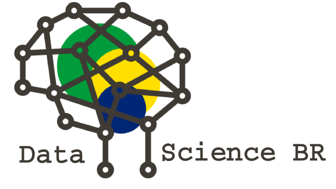

<h1 align="center">:microscope: Vagas</h1>

Espaço para divulgação de vagas para data scientists.

# (Somente vagas de Data-Science)

Espaço para a divulgação de vagas para desenvolvedores, estatísticos, matemáticos e etc via _issues_ do Github.

 * Vagas disponíveis em https://github.com/datascience-br/vagas/issues

### :office: Cadastrando uma vaga

1. Abra uma **issue** e, no titulo desta _issue_, coloque o nome da cidade entre colchetes seguido do nome da vaga e nome da empresa.

Exemplo: `[São Paulo] Computer vision engineer na [NOME DA EMPRESA]`

2. Informe quais _labels_ devemos adicionar, contendo o nível de experiência desejada e a forma de contração.

:warning: **Atenção**: Não aceitaremos vagas sem o nome da empresa contratante.

#### Importante :heavy_exclamation_mark:

1. Para evitar que possíveis candidatos enviem cvs para vagas já preenchidas, dê manutenção à sua issue, a cada 14 dias (2 semanas) coloque um comentário que continua procurando para a vaga ou feche a mesma comentando se a pessoa foi contratada através do nosso grupo ou por fora. Caso a issue passe de 14 dias e não tiver manutenção, a mesma poderá ser fechada por um moderador do repositório.

2. Se a vaga está pendente de informação e/ou fora do padrão especificado no [modelo da issue](https://github.com/datascience-br/vagas/blob/master/.github/issue_template.md), um dos moderadores ou administradores poderá fechar a issue. Ela pode ser reaberta a qualquer momento, desde que tenha sido devidamente preenchida.

### :octocat: Outros repositórios de vagas

Esse repositório não é específico para um único tipo devagas de **TI**,
mas mesmo assim existem vagas para muitas outras áreas nesse mercado sendo compartilhadas por outras comunidades, algumas pessoas
da comunidade forkaram o repositório do FrontEndBR e criaram outras listas específicas
para diferentes _stacks_ e estados do país. Confira abaixo as outras
listas onde você poderá postar sua vaga também:

#### Por área

- [Vagas para desenvolvedores Back-End](https://github.com/backend-br/vagas)
- [Vagas para desenvolvedores Front-End](https://github.com/frontendbr/vagas)
- [Vagas para desenvolvedores Chat-Bot](https://github.com/chatbotbr/vagas)
- [Vagas para Data Science](https://github.com/datascience-br/vagas)
- [Vagas para UI/UX](https://github.com/uxbrasil/vagas)
- [Vagas para QAs](https://github.com/qa-brasil/vagas)

#### Por tecnologia

- [Vagas para desenvolvedores Android](https://github.com/androiddevbr/vagas)
- [Vagas para desenvolvedores iOS e OSX](https://github.com/CocoaHeadsBrasil/vagas)
- [Vagas para desenvolvedores PHP](https://github.com/phpdevbr/vagas)
- [Vagas para desenvolvedores Python](https://github.com/pydevbr/vagas)
- [Vagas para desenvolvedores Vue.js](https://github.com/vuejs-br/vagas)
- [Vagas para desenvolvedores Go/Golang](https://github.com/Gommunity/vagas)
- [Vagas para desenvolvedores Flutter](https://github.com/flutter-brazil/vagas)
- [Vagas para desenvolvedores React/React Native](https://github.com/react-brasil/vagas)
- [Vagas para desenvolvedores .NET](https://github.com/dotnetdevbr/vagas)
- [Vagas para desenvolvedores Rust](https://github.com/rustdevbr/vagas)
- [Vagas para desenvolvedores Elm](https://github.com/FidelisClayton/elm-jobs)
- [Vagas para desenvolvedores Kotlin](https://github.com/kotlin-br/vagas)

#### Por localidade

- [Vagas para desenvolvedores no Ceará](https://github.com/CangaceirosDevels/vagas_de_emprego)
- [Vagas para desenvolvedores em Feira de Santana/Bahia](https://github.com/devfsa/vagas)
- [Vagas para desenvolvedores Front-end (Angola)](https://github.com/frontend-ao/vagas)
- [Vagas para desenvolvedores Back-end (Angola)](https://github.com/backend-ao/vagas)
- [Vagas para desenvolvedores Front-end (Portugal)](https://github.com/frontend-pt/vagas)
- [Vagas para desenvolvedores Back-end (Portugal)](https://github.com/backend-pt/vagas)

## :copyright: Licença

[MIT](/LICENSE) &copy; DataScienceBR

## :octocat: Repositórios da Data science Brasil

- [Eventos](https://github.com/datascience-br/eventos)

## :shipit: Author
Esse é um projeto originalmente desenvolvido pela comunidade FrontEndBR: https://github.com/frontendbr
